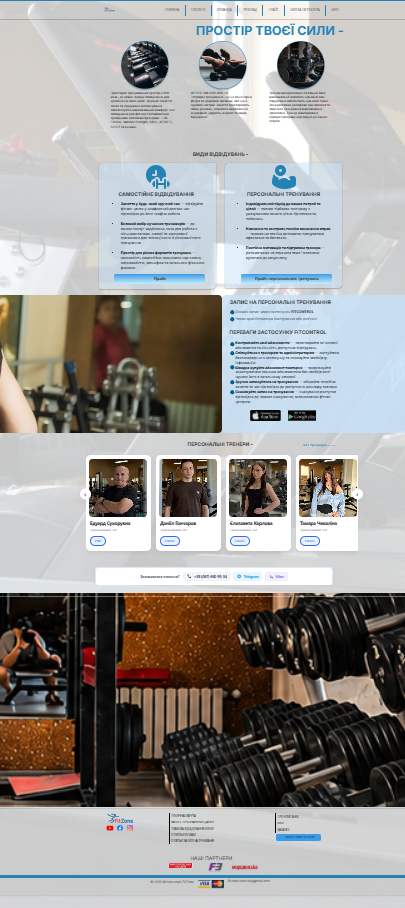

## Призначення

Показати простір тренажерного залу (600 кв.м, обладнання, бренди), пояснити формати відвідування (самостійне / персональне) і підвести до прайсу, запису через Fitcontrol або переходу до тренерів.

## Контент і блоки

1. Шапка: лого + меню (Головна, Послуги ▾, Команда, Розклад, Прайс, Школа інструктора ▾, Блог) — те саме, що на головній
2. Hero: фото залу + заголовок "ПРОСТІР ТВОЄЇ СИЛИ", опис простору 600 кв.м та перелік брендів обладнання (Life Fitness, Hammer Strength, VASIL, AEROFIT, SPIRIT та ін.)
3. Блок переваг — 3 пункти з іконками: "Фітнес змінює життя", опис тренажерних зон (кросовер/вільна вага/кардіо/розтяжка), підбір програми тренером
4. Блок "САМОСТІЙНЕ ВІДВІДУВАННЯ" — список переваг + кнопка "Прайс"
5. Блок "ПЕРСОНАЛЬНІ ТРЕНУВАННЯ" — список переваг + кнопка "Прайс персональних тренувань"
6. Блок "ВИДИ ВІДВІДУВАНЬ" — фото залу + опис запису на персональні тренування (через застосунок Fitcontrol або адміністратора)
7. Переваги застосунку Fitcontrol — список фіч + кнопки Google Play / App Store
8. Блок "ПЕРСОНАЛЬНІ ТРЕНЕРИ" — посилання "Усі тренери" (на /komandalev)
9. Футер: соцмережі, юридичні посилання, партнери, оплата, контактний email

## Що буде динамічним

- Блок "ПЕРСОНАЛЬНІ ТРЕНЕРИ" — дані тренерів (з БД, синхронізовано зі сторінкою /team)

## Що статичне

Все інше — hero, блок переваг, блок "Самостійне відвідування", блок "Персональні тренування", блок "Види відвідувань" з фото залу (це прописана html-сторінка, не з БД), промо Fitcontrol, футер

## Форми / інтеграції

Немає власної форми, тільки посилання на застосунок Fitcontrol (сторонній, не робимо самі) та на прайс

## Скріншоти

