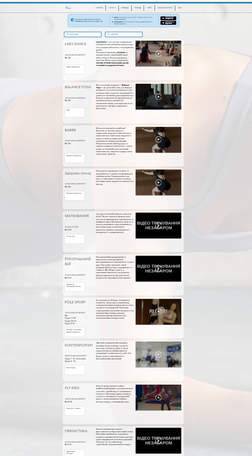

## Призначення

Показати каталог групових тренувань з можливістю фільтрації за категорією та тренером, дати детальний опис кожного напрямку (вік, тип абонементу, тренер, опис).

## Контент і блоки

1. Шапка: лого + меню (те саме, що на інших сторінках)
2. Hero: банер-фото
3. Блок фільтрів: "ОБЕРІТЬ КАТЕГОРІЮ" + "ОБЕРІТЬ ТРЕНЕРА" — два випадаючі списки для фільтрації тренувань нижче
4. Список карток тренувань (наразі ~29 напрямків: Fit Mix, Barre, Зумба, Kangoo Jumps, Степ аеробіка, Power Fit, Lady Dance, TRX, Пілатес, Йога та ін.) — кожна картка містить:
   - назву напрямку
   - тип абонементу (Загальний / Авторський / Разова оплата)
   - вікову категорію (напр. "18+", "6-10", "Група 1 7-18" тощо)
   - тренера (одного або кількох)
   - опис тренування
   - інколи додаткову примітку (напр. розміри взуття для Kangoo, "запис можливий тільки через адміністратора")
5. Футер: соцмережі, юридичні посилання, партнери, оплата, контактний email

## Що буде динамічним

- Фільтри "Категорія" і "Тренер" — значення підтягуються з БД
- Весь список тренувань — картки формуються з БД (назва, категорія, тип абонементу, вік, тренер(и), опис, примітки)
- **Потрібна адмін-панель для цієї БД** — щоб адміністратор міг додавати/редагувати/видаляти напрямки тренувань, призначати тренерів, змінювати описи та примітки без втручання розробника

## Що статичне

Шапка, hero-банер, футер

## Форми / інтеграції

Немає форми запису на самій сторінці — це інформаційний каталог. Запис на тренування відбувається через застосунок Fitcontrol або адміністратора (як зазначено в описах окремих напрямків)

## Скріншоти

