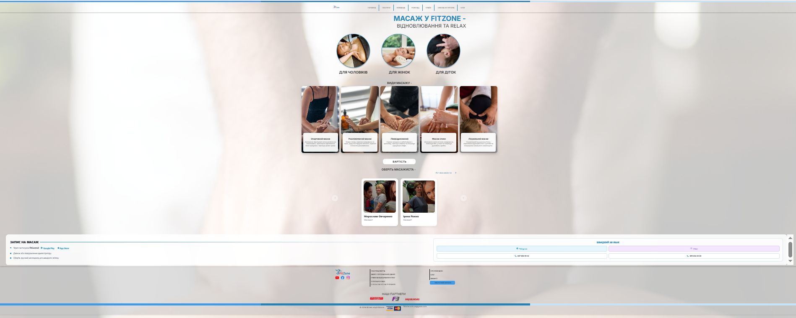

## Призначення

Показати послугу масажу — види масажу для чоловіків/жінок/дітей, дати можливість обрати масажиста, підвести до прайсу та контактів для запису.

## Контент і блоки

1. Шапка: лого + меню (те саме, що на інших сторінках)
2. Hero: банер "МАСАЖ У FITZONE" + підзаголовок "ВІДНОВЛЮВАННЯ ТА RELAX"
3. Блок категорій — 3 іконки: "Для чоловіків", "Для жінок", "Для діток"
4. Блок "ВИДИ МАСАЖУ" — картки видів масажу (фото + назва + короткий опис), без цін на сторінці:
   - Спортивний масаж — підготовка м'язів, прискорення відновлення, зниження ризику травм
   - Розслабляючий масаж — зняття втоми та нервового напруження
   - Лімфодренажний — виведення зайвої рідини, зменшення набряків
   - Масаж спини — зняття м'язового напруження, покращення рухливості хребта
   - Лікувальний масаж — усунення болю, відновлення функцій м'язів і суглобів
   Під блоком — кнопка переходу на сторінку "Прайс" (вартість дивиться там)
5. Блок "ОБЕРІТЬ МАСАЖИСТА" — карусель, показує всіх масажистів (наразі їх 2, можна свайпати вправо/вліво якщо стане більше), кнопка "Усі масажисти" веде на сторінку команди (/komandalev) з фільтром, що показує тільки масажистів з БД
6. Кнопка/посилання для зв'язку (чат або контакт адміністратора) — для запису на масаж
7. Футер: соцмережі, юридичні посилання, партнери, оплата, контактний email

## Що буде динамічним

- Блок "ОБЕРІТЬ МАСАЖИСТА" — карусель масажистів на цій сторінці + фільтр на сторінці команди — дані з БД (аналогічно тренерам)

## Що статичне

Все інше — hero, блок категорій (чоловіки/жінки/діти), блок видів масажу з описами, кнопка на прайс, футер

## Форми / інтеграції

Немає власної форми запису. Кнопки ведуть на сторінку "Прайс" та на чат/контакт для зв'язку з адміністратором (запис на масаж)

## Скріншоти

