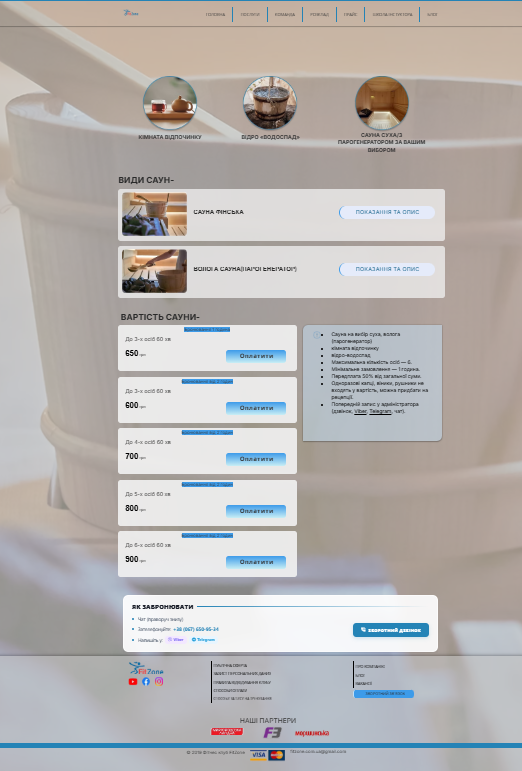

# Документація сторінки: Сауна (Sauna)

**URL:** `https://www.fitzone.com.ua/sauna`

---

## Призначення

Презентувати послуги сауни, ознайомити з деталями та видами саун через динамічний контент, підвести до перегляду прайсу та надати можливість швидкого запису через мессенджери.

---

## Контент і блоки

* **Шапка:** лого + меню (те саме, що на інших сторінках)
* **Hero:** банер з назвою та підзаголовком послуг сауни
* **Блок "ВИДИ САУНИ / ОПИС":** картки з видами та деталями саун. При кліку на картку відкривається динамічна сторінка з деталізацією та повним описом
* **Блок "ПРАЙС":** вивід актуальної вартості та тарифів сауни (отримуємо дані через API)
* **Блок запису / Канали зв'язку:** кнопки для швидкого запису та онлайн-бронювання через месенджери (Viber, Telegram) безпосередньо з адміністратором
* **Футер:** соцмережі, юридичні посилання, партнери, оплата, контактний email

---

## Що буде динамічним

* **Блок "ВИДИ САУНИ / ОПИС":** динамічна сторінка та картки опису саун (отримання даних з CMS / БД)
* **Блок "ПРАЙС":** отримуємо дані з API

---

## Що статичне

* **Hero-банер**, шапка, кнопки переходу в месенджери (Viber / Telegram), футер

---

## Форми / інтеграції

* **Немає власної форми запису.** Кнопки запису ведуть безпосередньо на чати в месенджерах (Viber, Telegram) для прямого зв'язку з адміністратором та бронювання часу.

---

## Скріншоти

