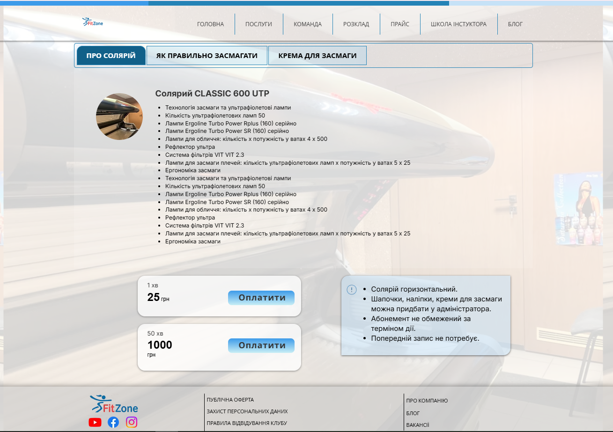

# Документація сторінки: Солярій (Solarium)

**URL:** `https://www.fitzone.com.ua/solarium`

---

## Призначення

Ознайомити відвідувачів із послугами солярію, надати детальну інформацію про типи/правила засмаги через вкладки, продемонструвати актуальний прайс та проінформувати про умови відвідування без попереднього запису.

---

## Контент і блоки

* **Шапка:** лого + меню (те саме, що на інших сторінках)
* **Hero:** банер з назвою та підзаголовком послуг солярію
* **Блок "ОПИС / ІНФОРМАЦІЯ":** блок із 3 інтерактивними вкладками (табами) для перемикання та перегляду детальної інформації про солярій
* **Блок "ПРАЙС":** вивід актуальної вартості хвилин та абонементів (отримуємо дані через API)
* **Блок запису / Інформаційна плашка:** спеціальна плашка з інформацією про те, що попередній запис на солярій **не потрібен** (жива черга / вільний доступ)
* **Футер:** соцмережі, юридичні посилання, партнери, оплата, контактний email

---

## Що буде динамічним

* **Блок "ПРАЙС":** отримуємо дані з API

---

## Що статичне

* **Hero-банер**, шапка, блок вкладок з описом (3 вкладки), інформаційна плашка про відсутність запису, футер

---

## Форми / інтеграції

* **Немає форм запису та кнопок месенджерів.** Запис не потрібен — на сторінці розміщена лише інформаційна плашка з умовами відвідування.

---

## Скріншоти

