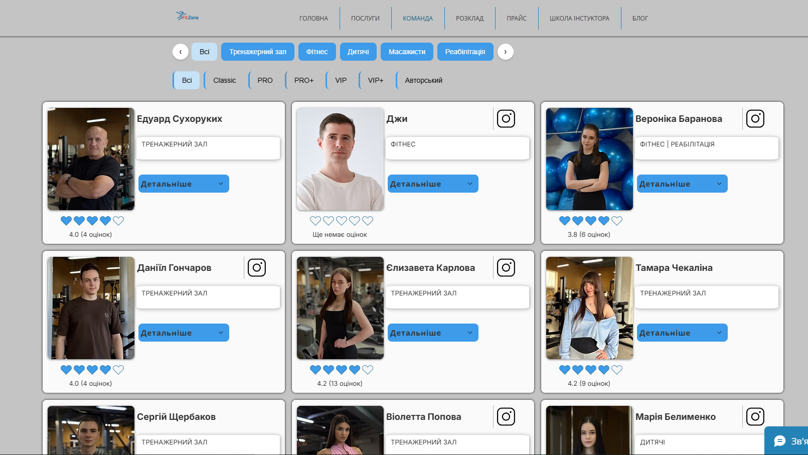

# Документація сторінки: Команда / Тренери (Team)

**URL:** `https://www.fitzone.com.ua/komandalev`

---

## Призначення

Представити тренерський склад клубу, надати зручний інструмент фільтрації за напрямками та кваліфікацією, дати можливість детально ознайомитися з карткою кожного тренера (через розгортання детальної інформації) та перейти до відповідного розділу прайсу за кваліфікацією.

---

## Контент і блоки

* **Шапка:** лого + меню (те саме, що на інших сторінках)
* **Hero:** банер із заголовком та коротким описом тренерського складу
* **Блок Фільтрів:** 
  1. *Фільтр 1 (Групи / Категорії):* за напрямками (тренажерний зал, групові програми, дитячі секції тощо)
  2. *Фільтр 2 (Кваліфікація):* за рангом/рівнем тренера (наприклад, Інструктор, Мастер-тренер, Експерт тощо)
* **Блок "КАРТКИ ТРЕНЕРІВ":** сітка/список карток з фото, ім'ям та кваліфікацією тренера
  * **Розгортання картки («Детальніше»):** при натисканні на кнопку «Детальніше» картка розгортається безпосередньо на сторінці, показуючи детальний опис тренера (досвід, регалії, спеціалізацію)
  * **Кнопка всередині розгорнутої картки:** перехід на сторінку "Прайс" (`/price`) із заздалегідь застосованим фільтром вартості для відповідної кваліфікації обраного тренера
* **Футер:** соцмережі, юридичні посилання, партнери, оплата, контактний email

---

## Що буде динамічним

* **Блок "КАРТКИ ТРЕНЕРІВ" та Фільтри:** усі дані про тренерів (фото, описи, категорії, кваліфікації) підтягуються з **нашої власної бази даних (БД)**.
* **Адмінпанель (Admin Panel):** управлінський інтерфейс у БД/адмінці для повного CRUD-циклу — додавання, редагування, видалення та зміни статусів/кваліфікацій тренерів.
* **Перехід на прайс:** динамічна генерація посилання з параметром/фільтром кваліфікації для сторінки Прайсу (де самі ціни отримуємо з API).

---

## Що статичне

* **Hero-банер**, шапка, загальна верстка сітки та фільтрів, футер

---

## Форми / інтеграції

* **Немає власної форми запису.** Кнопка з розгорнутої картки тренера перенаправляє на сторінку Прайсу для перегляду вартості занять за відповідною кваліфікацією.

---

## Скріншоти

