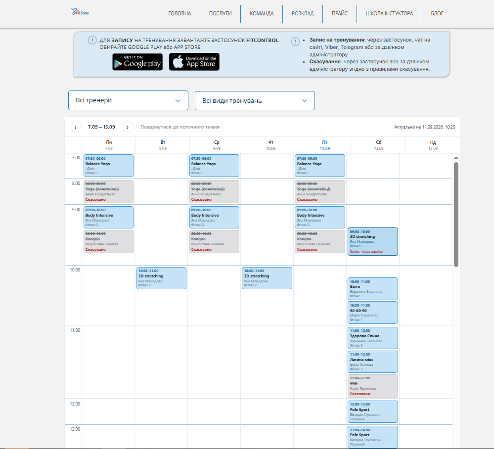

# Документація сторінки: Розклад (Schedule)

**URL:** `https://www.fitzone.com.ua/rozkladfitzone`

---

## Призначення

Дати відвідувачу переглянути актуальний розклад групових тренувань на тиждень із фільтрацією за тренером та видом тренування, а також коротко пояснити, як записатись на тренування і як скасувати запис.

---

## Контент і блоки

* **Шапка:** лого + меню (те саме, що на інших сторінках), пункт «РОЗКЛАД» активний
* **Інформаційна плашка (2 колонки):**
  * зліва — заклик завантажити застосунок **Fitcontrol** для запису на тренування, кнопки Google Play / App Store
  * справа — коротка інструкція: **Запис на тренування** — через застосунок, чат на сайті, Viber, Telegram або за дзвінком адміністратору; **Скасування** — через застосунок або за дзвінком адміністратору згідно з правилами скасування
* **Блок фільтрів:** 2 випадні списки
  1. *Тренер* — за замовчуванням «Всі тренери»
  2. *Вид тренування* — за замовчуванням «Всі види тренувань»
* **Блок розкладу (тижневий календар):**
  * навігація по тижнях: стрілки «назад» / «вперед» + діапазон дат (напр. «7.09 – 13.09») + кнопка «Повернутися до поточного тижня»
  * позначка актуальності даних — «Актуально на [дата, час]»
  * сітка: рядки — час (погодинно, з раннього ранку), колонки — дні тижня Пн–Нд з датами
  * кожна комірка — картка тренування: час початку–кінця, назва тренування, ім'я тренера, зал (Фітнес 1 / Фітнес 2 / Фітнес 3)
  * скасовані тренування — закреслений текст картки + позначка «Скасовано» червоним; окремі картки мають примітку про альтернативний спосіб запису (напр. «Запис через адміна»)
* **Футер:** соцмережі, юридичні посилання, партнери, оплата, контактний email (в кадр скріншота не потрапив, але присутній за аналогією з іншими сторінками)

---

## Що буде динамічним

* **Увесь блок розкладу** — картки тренувань (час, назва, тренер, зал, статус «скасовано») отримуємо з API в реальному часі, включно з позначкою «Актуально на …»
* **Фільтри «Тренер» і «Вид тренування»** — списки значень підтягуються з БД/API
* Ця сторінка на новому сайті працює за тим самим принципом, що й зараз (дані з API) — логіку відображення розкладу переносимо, а не переписуємо з нуля

---

## Що статичне

* Шапка, інформаційна плашка (текст про застосунок Fitcontrol і правила запису/скасування), футер

---

## Форми / інтеграції

* Власної форми запису на сторінці немає. Запис на тренування — через застосунок Fitcontrol, чат на сайті, Viber, Telegram або дзвінок адміністратору; скасування — аналогічно, через застосунок або дзвінок адміністратору

---

## Скріншоти

