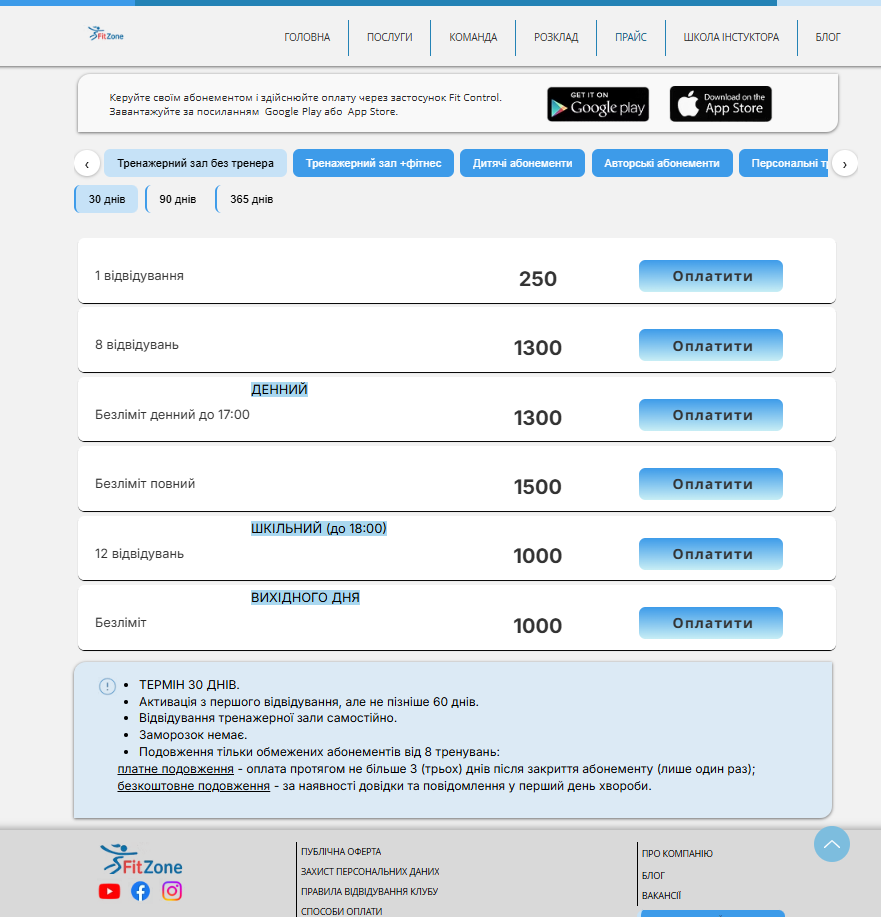

# Документація сторінки: Прайс (Price)

**URL:** `https://www.fitzone.com.ua/price-lev`

---

## Призначення

Показати актуальну вартість усіх видів абонементів клубу з фільтрацією за категорією послуги та другим (залежним) фільтром, дати змогу одразу перейти до оплати обраного абонемента.

---

## Контент і блоки

* **Шапка:** лого + меню (те саме, що на інших сторінках), пункт «ПРАЙС» активний
* **Інформаційна плашка зверху:** заклик керувати абонементом і оплачувати через застосунок **Fit Control**, кнопки Google Play / App Store
* **Блок першого фільтра (категорії):** горизонтальна стрічка табів-кнопок (прокручується стрілками ‹ ›), наприклад: «Тренажерний зал без тренера», «Тренажерний зал +фітнес», «Дитячі абонементи», «Авторські абонементи», «Персональні тренування», «Масаж», «Сауна», «Солярій» та ін.
* **Блок другого фільтра (залежить від категорії):** перемикачі-таби, набір яких **динамічно змінюється залежно від обраної категорії** у першому фільтрі:
  * для «Тренажерний зал» — термін дії: «30 днів» / «90 днів» / «365 днів»
  * для «Масаж» — категорія: «Жіночий» / «Чоловічий» / «Дитячий»
  * для «Персональні тренування» — кваліфікація тренера: «Класик» / «Про» тощо
  * для «Сауна» і «Солярій» — другий фільтр відсутній (порожній, тарифи показуються одразу)
* **Список тарифів** для обраної комбінації фільтрів — рядки таблиці:
  * назва абонемента (напр. «1 відвідування», «8 відвідувань», «Безліміт денний до 17:00», «Безліміт повний», «12 відвідувань», «Безліміт»)
  * деякі рядки мають додаткову позначку-підзаголовок над назвою («ДЕННИЙ», «ШКІЛЬНИЙ (до 18:00)», «ВИХІДНОГО ДНЯ»)
  * ціна
  * кнопка «Оплатити»
* **Інформаційна плашка знизу (умови абонемента):** список умов для обраної комбінації фільтрів — термін дії, правила активації, правила самостійного відвідування, умови заморозки, умови й вартість платного/безкоштовного подовження
* **Футер:** соцмережі, юридичні посилання (Публічна оферта, Захист персональних даних, Правила відвідування клубу), «Про компанію», Блог, Вакансії, способи оплати

---

## Що буде динамічним

* **Перший фільтр (категорії)** — список категорій з БД/API
* **Другий фільтр** — набір значень та їх тип (термін / стать-вік / кваліфікація / відсутній) залежить від обраної категорії й теж підтягується з API. Логіка «яка категорія → який другий фільтр» має зберігатись у БД, а не бути захардкодженою на фронті
* **Самі тарифи** (назва, ціна, доступні терміни) для обраної комбінації фільтрів — з API
* **Плашка з умовами внизу** — з БД, прив'язана до обраної комбінації фільтрів
* **Важливий нюанс:** не всі назви абонементів з API мають коректний вигляд для показу відвідувачу. Зараз для цього в Wix зроблена окрема «перехідна» таблиця — відповідність технічної назви поля з API до назви, яку бачить користувач на екрані. Цю логіку мапінгу потрібно перенести в нашу БД/адмінку, щоб адміністратор міг сам редагувати відображувані назви абонементів без втручання розробника
* Кнопка «Оплатити» — інтеграція з платіжною системою (деталі уточнити окремо)

---

## Що статичне

* Шапка, інформаційна плашка зверху (про Fit Control), футер

---

## Форми / інтеграції

* **Оплата абонемента:** кнопка «Оплатити» на кожному тарифі — веде на платіжну систему
* **Керування абонементом:** через застосунок Fit Control (сторонній, не робимо самі)

---

## Скріншоти

